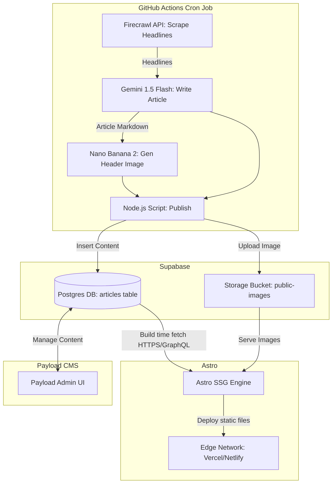

# dffwdaily.com System Architecture

This document outlines the overarching system architecture for dffwdaily.com, designed by the Software Architect to ensure a decoupled, zero-cost, and high-performance automated news engine.

## 1. System Blueprint: Data Flow

The system employs a uni-directional, decoupled data flow designed to run on a predictable schedule and cost zero dollars.

## 2. Database Schema

The core Supabase database will run on PostgreSQL. The central entity is the `articles` table. 

**Table: `articles`**
| Column | Type | Constraints | Description |
|--------|------|-------------|-------------|
| `id` | `uuid` | Primary Key, default `uuid_generate_v4()` | Unique identifier |
| `title` | `text` | Not Null | The headline of the article |
| `content` | `text` | Not Null | Article content in valid Markdown |
| `image_url` | `text` | Not Null | URL referencing the Supabase storage bucket |
| `published_at` | `timestamptz` | default `now()` | Timestamp of publication |
| `status` | `text` | Not Null, default `'published'` | Values like `published`, `draft`, `archived` |

**Security Rules (Row Level Security)**: 
- `SELECT` policies will be configured to allow public, anonymous reads for articles where `status = 'published'`.
- The GitHub Actions script will utilize a secure `Service Role Key` to bypass RLS for `INSERT` or automated updates.
- Payload CMS users will authenticate natively and inherit necessary CRUD permissions to the table.

## 3. API Routing Configuration

The Astro frontend must retrieve data during its build process to generate the static site. 

**Recommended Approach: Payload Local/REST API**
- Astro fetches data by hitting `https://[CMS_DOMAIN]/api/articles?where[status]=published`.
- We maintain Payload CMS as the single, authoritative abstraction layer over Supabase. This makes the frontend agnostic to the exact Postgres table structures, allowing the CMS layer to format the JSON predictably.

**Fallback Approach: Direct Supabase Fetching (For Maximum Free-Tier Simplicity)**
- If running a live Payload CMS instance incurs a cost, we can fallback to hitting Supabase directly: `fetch('https://[PROJECT-REF].supabase.co/rest/v1/articles?select=*&status=eq.published')`.
- In this model, Payload CMS is run locally only when manual editing is required. The live site directly queries the database at build time.

## 4. Performance Budget

- **Strict Zero-JS Baseline**: Core article pages must ship `0kb` of client-side JavaScript. This fulfills the 100/100 Lighthouse benchmark mandate.
- **Astro Islands**: Interactive elements (e.g., newsletter forms, theme togglers, dynamic trackers) must be strictly isolated using Astro's `client:idle`, `client:load`, or `client:visible` directives.
- **Optimized Assets**: The AI-generated images stored in Supabase must be processed by Astro's `<Image />` or `<Picture />` components to generate WebP/AVIF formats with correct `srcset` attributes automatically.
- **Typography Delivery**: We will utilize system fonts (`ui-sans-serif, system-ui, -apple-system, BlinkMacSystemFont, "Segoe UI", Roboto`) or highly optimized, self-hosted font files exclusively. No render-blocking font stylsheets.

## 5. Cost Management Strategy

We maintain a strict $0 ceiling utilizing existing free tiers across decoupled providers:
- **Compute (Automation)**: GitHub Actions provides 2,000 free runner minutes per month. Our scheduled Node.js script (running twice a week) will consume negligible minutes.
- **Database Backend**: Supabase Free Tier guarantees a 500MB database and 1GB storage cap. Because the cron runs twice a week, it satisfies the requirement of database activity within every 7-day period, preventing the project from pausing automatically.
- **Frontend Hosting**: Vercel/Netlify Free Tiers provide 100GB of bandwidth. For a statically generated HTML site with low initial traffic, this scaling limit is extremely safe.
- **Scraping & Gen AI**: Relying on Google AI Studio API limits (Gemini) and Nano Banana / Firecrawl free/dev tiers to maintain a $0 footprint for article generation.
